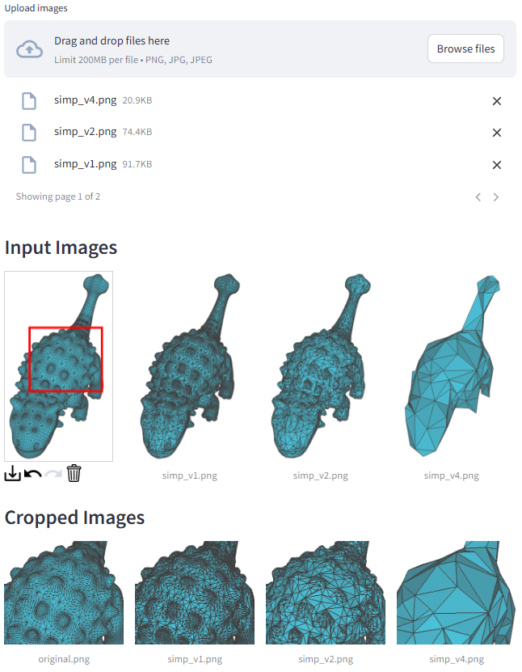

# ImgTrimmer

## Installation

```
git clone https://github.com/astaka-pe/ImgTrimmer.git
cd ImgTrimmer
python3 -m venv .venv

# Linux
source .venv/bin/activate # source .venv/bin/activate.fish

# Windows
.\.venv\Scripts\activate

pip install -r requirements.txt
```

## Demo

```
streamlit run app.py
```

